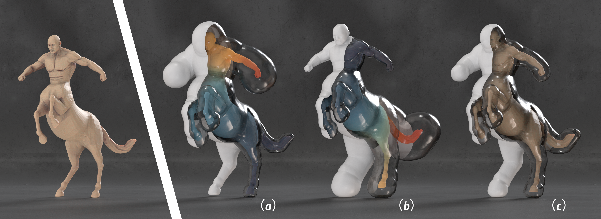
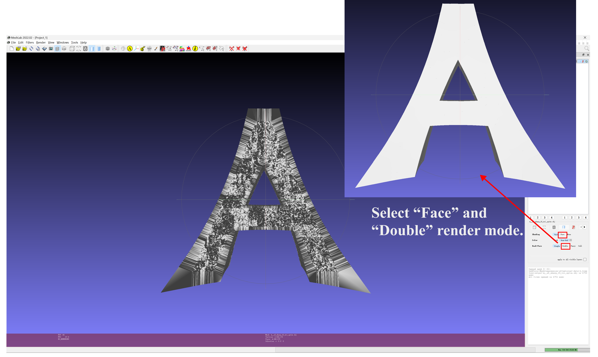

# OffsetCrust: Variable-Radius Offset Approximation with Power Diagrams



## Introduction
This is the official implementation of our paper "OffsetCrust: Variable-Radius Offset Approximation with Power Diagrams."

OffsetCrust is a novel framework that efficiently addresses the variable-radius offsetting problem by computing a power diagram.
Please refer to [our paper](https://arxiv.org/abs/2507.10924) for more details.

## Getting Started 

The results presented in our paper were obtained on the following platform:
- Windows 11
- Intel i9-13900K CPU
- 64GB memory

> We recommend using different package managers depending on your operating system:
> - Windows: We recommend using **vcpkg** to install the required packages
> - macOS: We recommend using **Homebrew (brew)** to install the required packages

### Dependencies
The following libraries are required for this project:
- CGAL
- Eigen3
- libigl
- cli11
- PQP
- Intel TBB
- OpenMP
- nanoflann

### Build On Windows
#### Step 1: Install Dependencies
```bash
vcpkg install cgal:x64-windows
vcpkg install eigen3:x64-windows
vcpkg install nanoflann:x64-windows
vcpkg install tbb:x64-windows
```
#### Step 2: Configure CMake
1. Change `toolchainFile` in `CmakePresets.json` to your vcpkg.cmake path (e.g.`E:/vcpkg/scripts/buildsystems/vcpkg.cmake`)
#### Step 3: Build with Visual Studio
1. In Visual Studio, open `File > Open > Folder > ./OffsetCrust`, and wait until CMake generation finished.
2. In Visual Studio, select x64 Release, `Build -> Rebuild All`. Then in folder `./out/build/x64-release/`, we have folders with corresponding generated `.exe` file in: `constant3d`, `variable3d`and `evaluation`.


### Build On MacOS

#### Step 1: Install Dependencies
```bash
brew install cgal
brew install eigen
brew install nanoflann
brew install tbb
brew install libomp
brew install llvm
```


#### Step 2: Configure Environment and Build
**Note: The following steps must be executed in the same terminal session.**

1. Open terminal and navigate to the project folder
2. Set environment variables:
   ```bash
   export CC=/opt/homebrew/opt/llvm/bin/clang
   export CXX=/opt/homebrew/opt/llvm/bin/clang++
   export LDFLAGS="-L/opt/homebrew/opt/llvm/lib"
   export CPPFLAGS="-I/opt/homebrew/opt/llvm/include"
   ```

3. Build project in the same terminal:
   ```bash
   mkdir build
   cd build
   cmake ..
   make
   ```


## Usage
> **Note**: To ensure the quality of results, the input triangle mesh needs to be of high quality (manifold, closed, free of self-intersections, with evenly sized dense triangles, and without narrow triangles). 
It is better to preprocess it using TetWild.

We have prepared pre-compiled `.exe` files in the `data` folder, along with some input meshes referenced in certain sections of our paper.
Below, we provide the commands to run the corresponding offset.

### Example Usage
The code provides necessary data files. Assuming the data folder path is `<data_folder>`, here's an example command:

```bash
./3DVer_variable --input <data_folder>/6_freeform/67855_sf.obj --outdir "<data_folder>/6_freeform/" --dis "<data_folder>/6_freeform/chair.txt" --sphere <data_folder>/sphere.obj --diag
```

### Command Format
```
./3DVer_variable [OPTIONS]
```

#### Required Parameters
- `--input TEXT`             Path to the input mesh file

#### Offset Parameters
- `-d FLOAT`                 Offset distance (relative to model size), default: 2%
- `--diag`                   Use offset distance relative to model bounding box diagonal
- `--dis TEXT`               User-defined distance file for variable offset distances
                            Format: Each line contains "vertex_id distance"
                            Note: Consider the norm of the gradient
- `--inside`                 Perform inside offset instead of outside offset
- `--sphere TEXT`            Input discrete spherical surface file

#### Output Parameters  
- `--outdir TEXT`            Output directory for results
- `--poly`                   Output polygon mesh results

#### Sampling Parameters
- `--blue INT`               Number of blue noise samples, default: 70000
- `--centroid`               Use triangle centroids instead of blue noise sampling
                            (Recommended for dense meshes)
- `--slerp INT`              Number of spherical interpolation steps, default: 10

#### Feature Preservation
- `--corner FLOAT`           Protection radius for non-smooth regions, default: 0.05
- `--sharp`                  Preserve all sharp features in offset
- `--diheral FLOAT`          Dihedral angle threshold (radians) for detecting sharp features, default: 0.2

#### Optimization Parameters
- `--lambda FLOAT`           Optimization parameter for surface reconstruction, default: 0.01

#### Performance
- `-t INT`                   Number of threads to use, default: 33


## Reproducing Paper Results

> **Note**: For the following examples, we assume the main executable has been moved to the `data` folder. Otherwise, you will need to modify the file paths accordingly.
> 
### 1_gallery
- Figure 3 (left): `.\3DVer_variable.exe --input "./1_gallery/00009875_086229ea796640d29acd68ff_trimesh_010__sf.obj" --outdir "./1_gallery/" --gallery --diag`
- Figure 3 (right): `.\3DVer_variable.exe --input "./1_gallery/44234_sf.obj" --outdir "./1_gallery/" --gallery --inside`


### 2_robustness
For model `54725`, `280279`, `99903`, `fandisk`:
- `.\3DVer_constant.exe --input "./2_robustness/fandisk.off" -d 0.02 --diag --outdir "./2_robustness/"`
- `.\3DVer_constant.exe --input "./2_robustness/fandisk.off" -d 0.02 --inside --diag --outdir "./2_robustness/"`

For model `bunny`, `beethoven`:
- `.\3DVer_constant.exe --input "./2_robustness/bunny_highquality.obj" -d 0.02 --diag --centroid --outdir "./2_robustness/"`
- `.\3DVer_constant.exe --input "./2_robustness/bunny_highquality.obj" -d 0.02 --inside --diag --centroid --outdir "./2_robustness/"`


### 3_comparisons
- 280279_pos: `.\3DVer_constant.exe --input "./3_comparisons/213887_sf.obj" --outdir "./3_comparisons/" -d 0.01 --diag`
- 280279_neg: `.\3DVer_constant.exe --input "./3_comparisons/213887_sf.obj" --outdir "./3_comparisons/" -d 0.008 --inside --diag`


### 4_ablation

#### kitten (blue noise)
- Blue noise samples
	- `.\3DVer_constant.exe --input "./4_ablation/kitten_smooth.obj" -d 0.04 --diag --outdir "./4_ablation/" --blue 35000 --inside`
- Centroids
    - `.\3DVer_constant.exe --input "./4_ablation/kitten_smooth.obj" -d 0.04 --diag --outdir "./4_ablation/" --centroid --inside`


#### block (change `--corner` to change $\rho$)
- `.\3DVer_constant.exe --input "./4_ablation/block.obj" -d 0.005 --diag --outdir "./4_ablation/" --corner 0.3 --centroid --inside`


#### block (sphere)
- sphere1 (#V=162)
    - `.\3DVer_constant.exe --input "./4_ablation/block.obj" -d 0.04 --diag --outdir "./4_ablation/" --sphere "./4_ablation/spheres/sphere1.obj" --slerp 5 --centroid --inside`

- sphere2 (#V=2562)
    - `.\3DVer_constant.exe --input "./4_ablation/block.obj" -d 0.04 --diag --outdir "./4_ablation/" --sphere "./4_ablation/spheres/sphere2.obj" --slerp 20 --centroid --inside`


### 5_freeform
> sharp mode is not robust for some offsets.

- Offset of (A): 
    + sharp: `.\3DVer_variable.exe --input "./6_freeform/A__sf.obj" --outdir "./6_freeform/" --gallery --sharp --diheral 0.001`
    + round: `.\3DVer_variable.exe --input "./6_freeform/A__sf.obj" --outdir "./6_freeform/" --gallery`
- User-defined input (67855): `.\3DVer_variable.exe --input ./6_freeform/67855_sf.obj --outdir "./6_freeform/" --dis "./6_freeform/chair.txt" --diag`


## View Output Files
All of our output `.obj` files can be opened with [MeshLab](https://www.meshlab.net/). Files ending with `_tri` represent unoptimized outputs, while those ending with `_tri_optim` are optimized outputs. You can follow these steps to view our results:
1. Open this file with MeshLab.
2. Select **Fill -> Shading -> Face** and **Fill -> Back-Face -> Double**.


